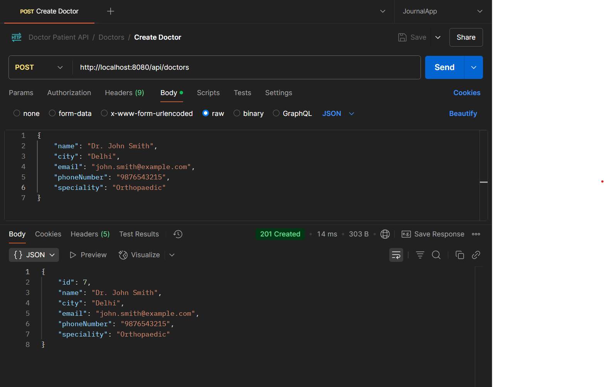
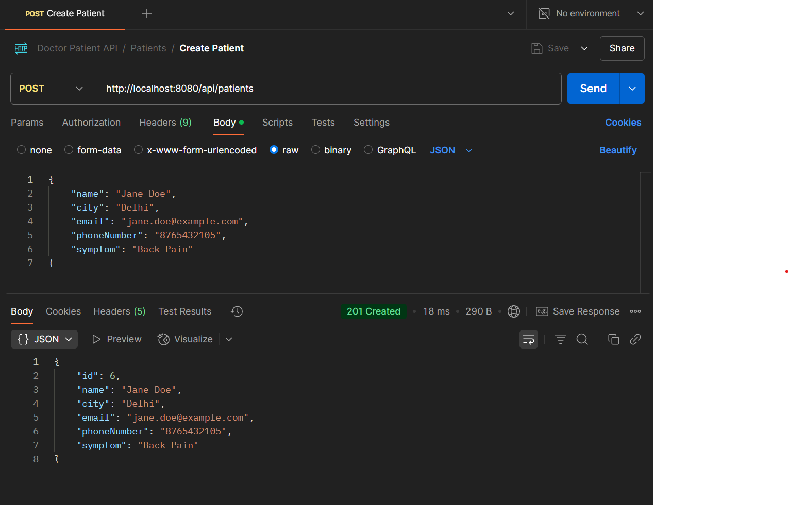
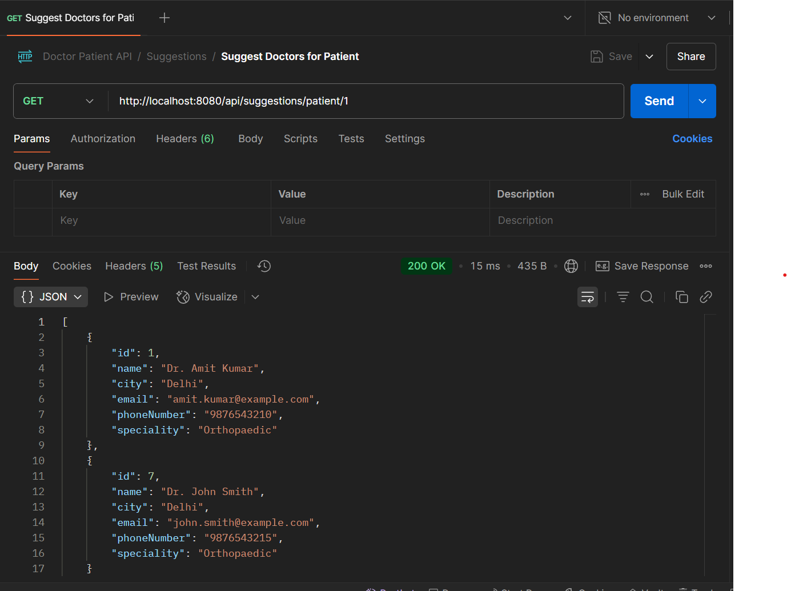
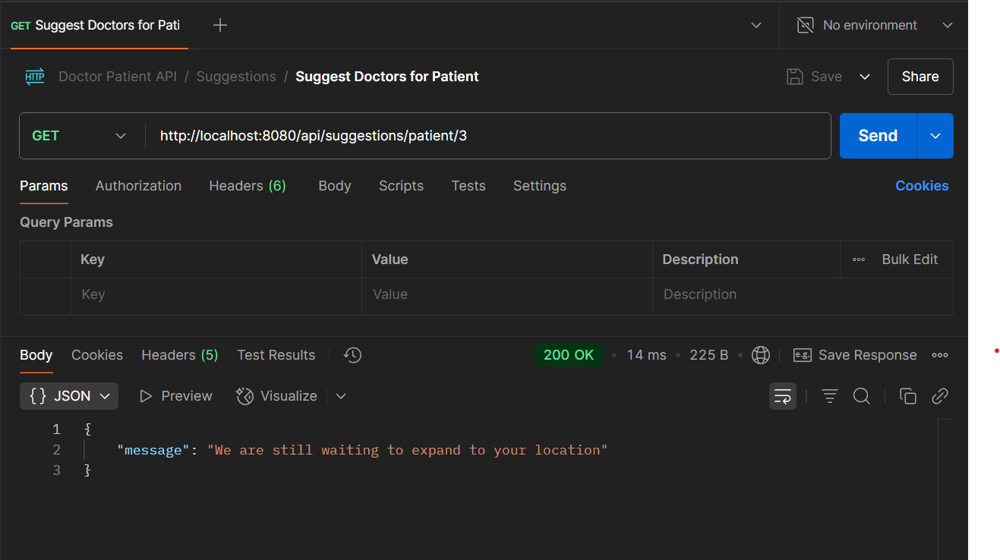
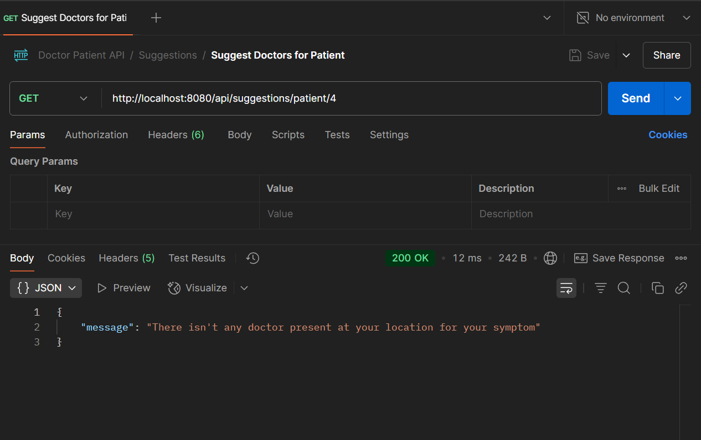

# Doctor Patient Management API

This is a Spring Boot 3 application that provides APIs for managing doctors, patients, and suggesting doctors based on patients' symptoms and locations.

## Features

- Add/remove doctors with their specialties
- Add/remove patients with their symptoms
- Suggest doctors to patients based on symptoms and location
- Validation for all input fields
- Swagger UI for API documentation

## Tech Stack

- Spring Boot 3.2.4
- Spring Data JPA
- Hibernate
- H2 Database
- SpringDoc OpenAPI (Swagger)
- Lombok

## Running the Application

1. Clone the repository
2. Build the project: `mvn clean install`
3. Run the application: `mvn spring-boot:run`
4. Access Swagger UI: http://localhost:8080/swagger-ui.html
5. Access H2 Console: http://localhost:8080/h2-console (JDBC URL: jdbc:h2:mem:doctordb, Username: sa, Password: empty)

## API Documentation

### Doctor APIs

- `POST /api/doctors` - Add a new doctor
- `GET /api/doctors` - Get all doctors
- `GET /api/doctors/{id}` - Get doctor by ID
- `DELETE /api/doctors/{id}` - Delete a doctor

### Patient APIs

- `POST /api/patients` - Add a new patient
- `GET /api/patients` - Get all patients
- `GET /api/patients/{id}` - Get patient by ID
- `DELETE /api/patients/{id}` - Delete a patient

### Suggestion API

- `GET /api/suggestions/patient/{patientId}` - Suggest doctors for a patient

## API Testing Screenshots

### Creating a Doctor



Request:
```json
{
    "name": "Dr. John Smith",
    "city": "Delhi",
    "email": "john.smith@example.com",
    "phoneNumber": "9876543215",
    "speciality": "Orthopaedic"
}
```

Response:
```json
{
    "id": 7,
    "name": "Dr. John Smith",
    "city": "Delhi",
    "email": "john.smith@example.com",
    "phoneNumber": "9876543215",
    "speciality": "Orthopaedic"
}
```

### Creating a Patient



Request:
```json
{
    "name": "Jane Doe",
    "city": "Delhi",
    "email": "jane.doe@example.com",
    "phoneNumber": "8765432105",
    "symptom": "Back Pain"
}
```

Response:
```json
{
    "id": 6,
    "name": "Jane Doe",
    "city": "Delhi",
    "email": "jane.doe@example.com",
    "phoneNumber": "8765432105",
    "symptom": "Back Pain"
}
```

### Suggesting Doctors for a Patient



Request:
GET /api/suggestions/patient/1

Response (for patient with arthritis in Delhi):
```json
[
    {
        "id": 1,
        "name": "Dr. Amit Kumar",
        "city": "Delhi",
        "email": "amit.kumar@example.com",
        "phoneNumber": "9876543210",
        "speciality": "Orthopaedic"
    },
    {
        "id": 7,
        "name": "Dr. John Smith",
        "city": "Delhi",
        "email": "john.smith@example.com",
        "phoneNumber": "9876543215",
        "speciality": "Orthopaedic"
    }  
]
```

### Edge Case: Patient Outside Supported Cities



Request:
GET /api/suggestions/patient/3

Response (for patient in Mumbai):
```json
{
    "message": "We are still waiting to expand to your location"
}
```

### Edge Case: No Doctor for Symptom in Location



Request:
GET /api/suggestions/patient/4

Response (assuming no Ear pain doctor in Faridabad):
```json
{
    "message": "There isn't any doctor present at your location for your symptom"
}
```

## Data Model

### Doctor
- id: Long
- name: String (min 3 chars)
- city: Enum (Delhi, Noida, Faridabad)
- email: String (valid email)
- phoneNumber: String (min 10 digits)
- speciality: Enum (Orthopaedic, Gynecology, Dermatology, ENT)

### Patient
- id: Long
- name: String (min 3 chars)
- city: String (max 20 chars)
- email: String (valid email)
- phoneNumber: String (min 10 digits)
- symptom: Enum (Arthritis, Back Pain, Tissue injuries, Dysmenorrhea, Skin infection, Skin burn, Ear pain)

## Speciality-Symptom Mapping

- Orthopaedic: Arthritis, Back Pain, Tissue injuries
- Gynecology: Dysmenorrhea
- Dermatology: Skin infection, Skin burn
- ENT: Ear pain